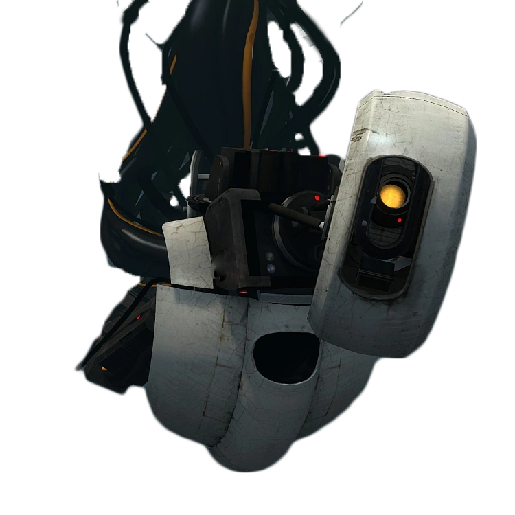

# Glados

## Details

- **Type**: Dell R6515
- **OS**: Debian 11
- **CPU**: AMD 7302P 3GHz, 16C/32T, 128M, 155W
- **RAM**: 2x 16GB RDIMM, 3200MT/s Dual Rank
- **Storage**: 4x 2TB SATA HDDs (hardware RAID)

Part of [aperture](index.md)

## Where to Find

- **Internal**:
	- `10.10.0.4`
- **External**:
	- `136.206.16.4`
	- `glados.redbrick.dcu.ie`
	- `glados.aperture.redbrick.dcu.ie`

