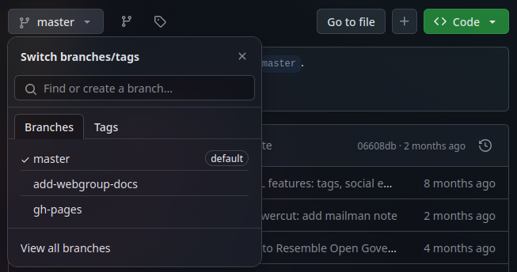
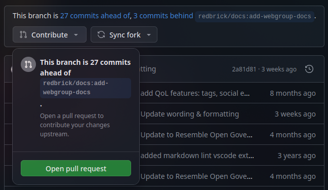
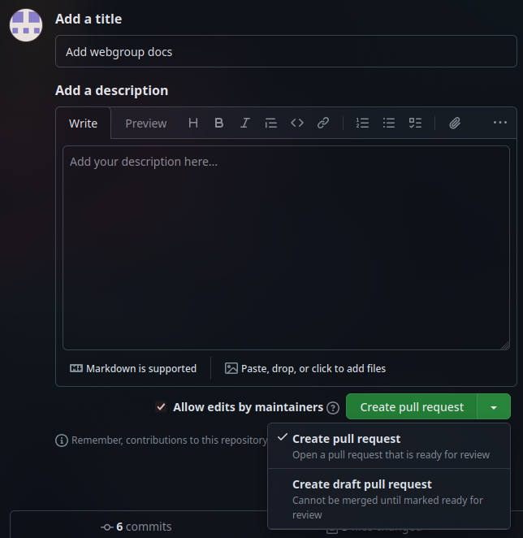

# Contributing to Webgroup

## Basic Contribution Workflow

- Fork the repository on GitHub.
- Clone your fork of the repository.

    ```bash
    git clone <your fork URL>
    ```

- Switch to a new branch (name it appropriately!)

    ```bash
    git checkout -b <new branch name>
    ```

- Make changes to the codebase.

    > [!NOTE]
    > You don't have to make all the necessary changes in one commit. It's much better to split a bigger pull request over multiple commits. This will make it easier to manage and review.

- Stage and commit the changes.

    ```bash
    git add <files you changed>
    git commit -m "<commit message>"
    ```

    > [!TIP]
    > See [Writing Meaningful Commit Messages](https://reflectoring.io/meaningful-commit-messages/)

- On GitHub, navigate to your fork repository and switch to the branch you created.

    

- Use the ":material-source-pull: Contribute" button to open the pull request page.

    

- Fill in the title and description fields, then open a pull request. If you have not finished making all the necessary changes, then open a **draft** pull request instead.

    


    > [!TIP]
    > For bigger contributions, it's advisable to open a draft pull request when you begin development so other maintainers (e.g. other members of webgroup) can review your changes and provide feedback as you work.
